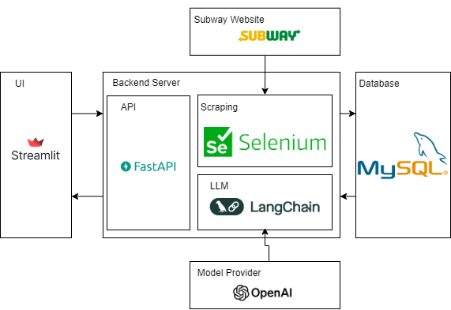

# Subway Outlets Location Tracker
This program helps users search for Subway outlets based on address or name. It visualizes outlet locations and their radius catchment status. Powered by LLM technology, it generates comprehensive answers to queries.

# Table of Contents
1.0 [Overall Architecture](#10-overall-architecture)

2.0 [Design Details](#20-design-details)
  - 2.1 [Web Scraping](#21-web-scraping)
    - 2.1.1 [Utilization of Selenium](#utilization-of-selenium)
    - 2.1.2 [Utilization of APScheduler](#utilization-of-apscheduler)
  - 2.2 [Geocoding and Radius Catchment](#22-geocoding-and-radius-catchment)
  - 2.3 [API and Frontend](#23-api-and-frontend)
  - 2.4 [LLM Development](#24-llm-development)
    - 2.4.1 [Why Use an SQL Agent?](#why-use-an-sql-agent)
    - 2.4.2 [Processing Operating Hours](#processing-operating-hours)

3.0 [Functions Implemented](#30-functions-implemented)
  - 3.1 [Visualizing Outlets](#31-visualizing-outlets)
  - 3.2 [Searching for Specific Outlets](#32-searching-for-specific-outlets)
  - 3.3 [Answering Questions](#33-answering-questions)

4.0 [Steps to Set Up](#40-steps-to-set-up)
  - 4.1 [Backend](#41-backend)
  - 4.2 [Frontend](#42-frontend)

# 1.0 Overall Architecture

- The system utilizes Selenium to scrape data from the Subway website to extract outlet details.
- The data is stored in a MySQL database.
- LangChain is used to develop an agent for question-answering.
- FastAPI is used to serve outlet details and expose the LLM service.
- Streamlit is used to build the user interface with map visualization.

# 2.0 Design Details
## 2.1 Web Scraping
### Utilization of Selenium
- The first step in web scraping is to track down any API calls or web requests that would allow direct data retrieval from the web server.
- However, after code inspection and utilizing the Network Tab in the browser, no such API call was found.
- Moreover, the content is dynamically generated based on user interactions (e.g., clicking actions).
- Therefore, Selenium, which can mimic a web browsing agent, was chosen to perform the scraping by simulating a search (inputting the term "Kuala Lumpur" and clicking the search button).

### Utilization of APScheduler
- A scheduler is used to automate the scraping process at a set interval.
- Scraping is triggered every 24 hours to ensure timely data updates.
- Otherwise, if the latest updated time has passed 24 hours, the scraping will be triggered right after the web server was started 

## 2.2 Geocoding and Radius Catchment
- Geocoding data is scraped along with outlet details from the website.
- Using geocoordinates, the distance between outlets can be computed.
- Outlets with overlapping 5 KM radius catchments are recorded.
  - The overlapping outlets are precomputed and stored in the database to avoid redundant calculations in the future.
  - Since distance computation has a complexity of O(n^2), persisting this data optimizes performance by trading storage for processing speed.
- To detect 5 KM radius catchment overlaps efficiently, a potential optimization technique is to sort outlets by geocoordinates and implement early stopping.

- However, this method would prevent distance computations between all outlets, limiting LLM capabilities in answering related queries.
- Therefore, full computation is used.
- The computed distances are stored as a pandas DataFrame, allowing indexing based on outlet IDs.

## 2.3 API and Frontend
- Data is exposed to the frontend using FastAPI.
- Streamlit is used to develop the UI.

## 2.4 LLM Development
- An LLM agent is developed to answer queries about the outlets.
- We utilize LangGraph's ReACT agent, as ReACT is a prompt engineering technique that enables effective interaction with external environments (in this case, the SQL database).
- The agent is equipped with a toolkit to access the SQL database, with 2 additional tools to retrieve distance between outlets and obtain the current datetime.

### Why Use an SQL Agent?
- Compared to RAG, using an SQL agent allows the LLM to issue SQL queries that include aggregate functions like COUNT and GREATEST.
- This enables answering analytical questions such as the number of outlets that match specific conditions or sorting outlets by operating hours.

### Processing Operating Hours
The unstructured format of operating hours poses a significant challenge for building a QA agent. For example, some outlets have different operating hours on different days (e.g., "Monday - Friday, 8:00 AM – 6:30 PM; Saturday, Sunday & Public Holiday, 8:00 AM – 3:00 PM"), while others maintain uniform hours (e.g., "Monday - Sunday, 10:00 AM - 10:00 PM").

This requires the LLM to read all rows in the column to interpret the operating hours, especially for aggregate queries (e.g., "Which outlet closes the latest?"). This incurs high computational costs and long processing times.

The solution implemented here is eager processing, where the LLM converts unstructured operating hour descriptions into a structured format immediately after scraping. This allows subsequent queries to be handled efficiently using SQL queries with clauses like GREATEST instead of requiring a full database read.

# 3.0 Functions Implemented
## 3.1 Visualizing Outlets

- Provides users with a map visualization featuring markers color-coded by radius catchment overlap status:
  - Red: More than 7 overlapping outlets.
  - Orange: More than 5 overlapping outlets.
  - Green: Less than 5 overlapping outlets.
- Purpose: Helps identify oversaturated and underserved regions.

## 3.2 Searching for Specific Outlets

- Users can search by clicking on a map marker or entering an address or name in the left panel.
- Purpose: Helps locate specific outlets, display their details, and visualize their radius catchment.

## 3.3 Answering Questions

- Provides answers to user queries about Subway outlets.

# 4.0 Steps to Set Up
## 4.1 Backend
1. Install dependencies using `poetry install`.
2. Set up environment variables with the OpenAI API key and database connection string. Variables include `DB_CONN`,  `DISTANCE_MATRIX_FILE_PATH`, `OPENAI_API_KEY`, `TIMEZONE`.
3. Start a shell session with `poetry shell`.
4. Run the FastAPI server with `uvicorn main:app --reload`.

## 4.2 Frontend
1. Install dependencies using `poetry install`.
2. Set up environment variables with the backend URL. Variables include `BACKEND_URL`, `DEFAULT_CENTER_LAT`, `DEFAULT_CENTER_LNG`, `LOCAL_TIMEZONE`
1. Start a shell session with `poetry shell`.
2. Run the Streamlit app with `streamlit run main.py`.

# 5.0 Future Enhancement
The solution can be futher enhanced with:
1. Containerize with docker for better deployment
2. Implement proper logging mechanism
3. Extending the current QA functions into a fully built chatbot with conversation thread management, and history contextualisation

